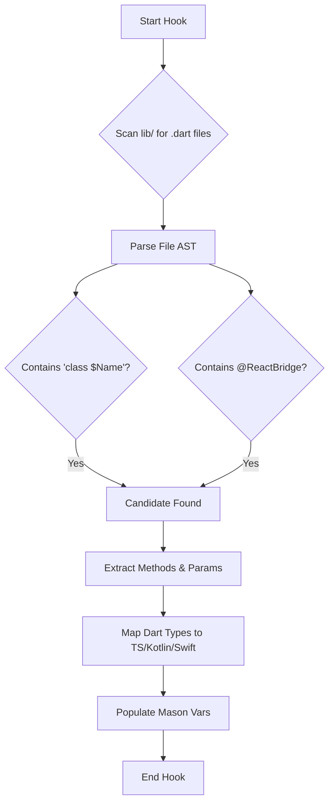

# Chimera Bridge Hooks 🪝

This directory contains the Mason hooks that power the intelligent generation features of Chimera Bridge.

## 🏗️ Overview

The generation process consists of two stages:

1.  **Pre-Gen (`pre_gen.dart`):** Scans the Flutter codebase, parses Dart classes, and prepares the variables for the Mustache templates.
2.  **Post-Gen (`post_gen.dart`):** Runs after generation to format code, fix standard linting issues, and provide helpful setup instructions to the user.

---

## 🔍 Pre-Gen Logic (`pre_gen.dart`)

The pre-generation hook is responsible for "understanding" your Dart code. It uses the `analyzer` package to parse the Abstract Syntax Tree (AST) of your Dart files.

### Workflow Diagram

### Type Mapping

We automatically map Dart types to their native equivalents using a lookup table in `pre_gen.dart`.

| Dart Type | TypeScript | Kotlin | Swift |
| :--- | :--- | :--- | :--- |
| `String` | `string` | `String` | `String` |
| `int`, `double` | `number` | `Double` | `NSNumber` |
| `bool` | `boolean` | `Boolean` | `Bool` |
| `Map` | `object` | `ReadableMap` | `NSDictionary` |
| `List` | `any[]` | `ReadableArray` | `NSArray` |

---

## 🧹 Post-Gen Logic (`post_gen.dart`)

The post-generation hook ensures the output is clean and ready to use.

### Key Operations

1.  **Pubspec Sync:** Updates the `androidPackage` and `iosBundleIdentifier` in `pubspec.yaml` to match the user's input.
2.  **Formatting:**
    *   **Dart:** Runs `dart format` on generated files.
    *   **Kotlin:** Runs `ktlint -F` (if installed).
    *   **Swift:** Runs `swift-format -i` (if installed).
    *   **Objective-C:** Runs `clang-format -i` (if installed).
3.  **User Guidance:** Prints the "Next Steps" instructions to the console, tailored to the generated module name.
